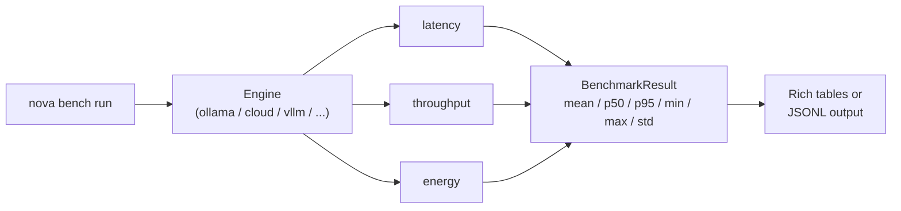

# Testing & Comparing LMs

Which model should you run? The honest answer is "measure" — and NOVA AI
ships a benchmark framework (`nova bench`) plus per-query telemetry that
makes the comparison concrete: latency, throughput, energy (joules), and
cost in dollars, all measured on **your** hardware, not a vendor's
marketing page.

This tutorial benchmarks a local Ollama model, then compares it against a
cloud model, and shows how to read the numbers.

!!! tip "Prerequisites"
    - NOVA AI installed: `uv sync --extra dev` from the repository root
    - An inference engine available (Ollama running, or a cloud API key)
    - For energy metrics on NVIDIA GPUs: `uv sync --extra gpu-metrics`

## The Bench Framework



Three benchmarks are built in and registered in `BenchmarkRegistry`:

| Benchmark | Measures | Key metrics |
|---|---|---|
| `latency` | Per-call wall time with short prompts | `mean_latency_s`, `p95_latency_s` |
| `throughput` | Tokens/sec generation speed | `mean_throughput_tok_per_sec`, `p95_*` |
| `energy` | Joules consumed during inference | `energy_per_token_joules`, `total_energy_joules` |

All metrics come back with full distribution stats (`mean`, `p50`, `p95`,
`min`, `max`, `std`) — means hide tail latency, and tails are what users
feel.

## Step 1: Benchmark a Local Model

```bash title="Terminal"
# All three benchmarks, 10 samples each
nova bench run --engine ollama --model qwen3:8b

# Just latency, 30 samples, 3 warmup iterations, JSON output
nova bench run --engine ollama --model qwen3:8b \
    --benchmark latency --samples 30 --warmup 3 --json
```

Flags worth knowing:

| Flag | Purpose |
|---|---|
| `--samples/-n` | Samples per benchmark (more = tighter std) |
| `--warmup/-w` | Discarded iterations that absorb cold-start costs |
| `--json` | Machine-readable summary to stdout |
| `--output/-o` | Write JSONL results to a file (for later comparison) |
| `--setup-energy` | Run the energy monitor setup script if missing |

## Step 2: Interpret the Results

A latency run prints per-metric stats tables:

```text
Metric             Value
-------------------------
mean_latency_s     1.2340
p50_latency_s      1.1000
p95_latency_s      2.4500
min_latency_s      0.9800
max_latency_s      3.1200
std_latency_s      0.3400
```

How to read it:

- **mean vs p50** — if `mean` is much higher than `p50`, a few slow calls
  (preemption, GC, thermal throttling) are dragging the average. Look at
  `max`.
- **p95** — the number your users actually feel. A model with a 1.0 s mean
  and 2.4 s p95 is *worse* for interaction than a 1.3 s mean / 1.5 s p95
  model.
- **std** — variance matters for predictability. High variance on a local
  GPU often means thermal throttling or memory pressure.
- **errors** — if `errors > 0`, treat the run as suspect; rerun with more
  warmup before trusting the numbers.

## Step 3: Compare Against a Cloud Model

The `cloud` engine runs cloud models via OpenRouter; results carry a
`cost_usd` per query. Run the identical benchmark against both:

```bash title="Terminal"
# Local
nova bench run --engine ollama --model qwen3:8b \
    --benchmark latency --samples 20 --output local.jsonl

# Cloud (requires OPENROUTER_API_KEY)
nova bench run --engine cloud --model anthropic/claude-haiku-4.5 \
    --benchmark latency --samples 20 --output cloud.jsonl
```

Because the output is JSONL, the two runs can be diffed or tabulated in a
spreadsheet, notebook, or `jq`. The table below shows the *shape* of a
comparison (illustrative numbers — your hardware will differ):

| Metric | local qwen3:8b | cloud haiku-4.5 |
|---|---|---|
| mean_latency_s | 1.23 | 0.87 |
| p95_latency_s | 2.45 | 1.05 |
| mean_throughput_tok_per_sec | 42 | 95 |
| energy_per_token_joules | 4.1 | 0 (remote) |
| cost per query | $0.00 | $0.0009 |

The comparison that matters is **not** "which is faster" — it's whether
the cloud's speed and quality edge is worth the cost and the privacy trade
for *your* workload. NOVA AI's local-first stance: use `model = "auto"`
routing so simple queries stay local and only complex ones escalate (see
[Secure Cloud Collaboration](../architecture/engine.md)).

## Step 4: Energy Measurement

The energy benchmark brackets each sample with the energy monitor for your
vendor (NVIDIA via NVML, AMD, Apple Silicon, or CPU RAPL):

```bash title="Terminal"
# One-time: install vendor energy dependencies
uv sync --extra energy-all

# Run energy benchmark with monitor setup
nova bench run --engine ollama --model qwen3:8b \
    --benchmark energy --setup-energy
```

If no monitor is available, the CLI tells you exactly which extra to
install (`nova_ai[energy-apple]` on Apple Silicon, `nova_ai[gpu-metrics]`
on Linux/NVIDIA, `nova_ai[energy-all]`) rather than silently reporting
zeros.

!!! note "What 'energy per token' buys you"
    `energy_per_token_joules` is the fairest cross-model metric: big models
    consume more total energy but may emit fewer tokens for the same task.
    Paired with telemetry's `avg_throughput_per_watt`, it answers "which
    model gets more work out of every watt my machine spends?"

## Step 5: Per-Query Telemetry in Real Conversations

Benchmarks are synthetic. For live workloads, telemetry records every
query automatically when `gpu_metrics` is enabled:

```toml
[telemetry]
gpu_metrics = true
```

With telemetry on, every engine call flows through `InstrumentedEngine`
into the telemetry store, including `Trace.total_cost_usd` for cloud
queries. The dashboard's telemetry panel and `nova telemetry` CLI read
from the same store — so after a week of normal use you can answer "what
does my assistant actually cost and consume per day?" with real numbers.

## Writing a Custom Benchmark

Subclass `BaseBenchmark`, register it, and it appears in the CLI:

```python title="Custom benchmark"
from nova_ai.bench import BaseBenchmark, BenchmarkRegistry
from nova_ai.bench._stats import compute_stats
from nova_ai.core.types import Message, Role


class FirstTokenBenchmark(BaseBenchmark):
    """Time to first token — the perceived responsiveness metric."""

    @property
    def name(self) -> str:
        return "first_token"

    @property
    def description(self) -> str:
        return "Measures time to first streamed token"

    def run(self, engine, model, *, num_samples=10, **kwargs):
        times = []
        for _ in range(num_samples):
            t0 = time.time()
            # stream=True yields chunks as they arrive
            for _chunk in engine.generate(
                [Message(role=Role.USER, content="Count to ten")],
                model=model,
                stream=True,
            ):
                times.append(time.time() - t0)
                break  # first chunk only
        metrics = compute_stats("ttft_s", times)
        # ... wrap in a BenchmarkResult as the built-ins do
```

Register with `@BenchmarkRegistry.register("first_token")` (or call
`BenchmarkRegistry.register_value`) and `nova bench run --benchmark
first_token` picks it up through the same `BenchmarkRegistry` used by
every other component type.

## Tips for Trustworthy Numbers

- **Warm up.** Always `--warmup 2` or more; the first call loads weights
  into VRAM and poisons the sample set.
- **Fix the variables.** Same machine, same power profile, same background
  load. A benchmark run during a `uv sync` tells you nothing.
- **More samples for tighter tails.** 10 samples gives a rough p95; 50
  gives a trustworthy one. `std` tells you when you have enough.
- **Compare distributions, not means.** `p95_latency_s` across two JSONL
  files is the comparison that predicts user experience.
- **Cloud costs add up.** `--samples 20` against a large cloud model is
  real money; start small.

## See Also

- [User Guide: Benchmarks](../user-guide/benchmarks.md) — full CLI reference
- [User Guide: Telemetry](../user-guide/telemetry.md) — per-query telemetry store
- [Architecture: Engine](../architecture/engine.md) — `MultiEngine` auto routing and cloud failover
- [Evals: Leaderboard](../evals/leaderboard.md) — eval suite beyond micro-benchmarks
