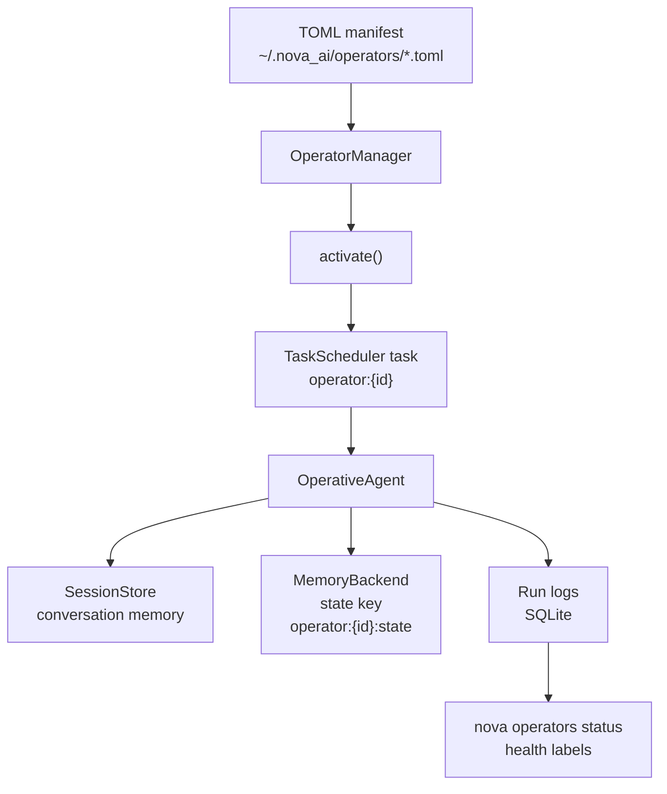

# Building Continuous Agents

Operators are NOVA AI's key differentiator — persistent, scheduled, stateful
agents that run autonomously on your machine. Where a normal chat turn lives
and dies inside one request, an operator wakes up on a schedule, remembers
what it did last time, and gets back to work.

This tutorial builds a **research operator** that monitors arXiv daily,
remembers what it has already seen, and keeps a persistent log of findings.

!!! tip "Prerequisites"
    - NOVA AI installed: `uv sync --extra dev` from the repository root
    - An inference engine running (Ollama with a small model pulled works fine)
    - The scheduler enabled in your `~/.nova_ai/config.toml`:

        ```toml
        [scheduler]
        enabled = true
        ```

## The Architecture



The flow: you write a TOML manifest, the `OperatorManager` loads it,
activation creates a deterministic scheduler task (`operator:{id}`), and each
tick runs an `OperativeAgent` that loads its previous conversation and
memory state before deciding what to do. Run logs feed the health monitor.

## Step 1: Write the Operator Manifest

Create `~/.nova_ai/operators/arxiv-monitor.toml` (or `./operators/` in a
project — both are scanned):

```toml title="~/.nova_ai/operators/arxiv-monitor.toml"
[operator]
id = "arxiv-monitor"
name = "arXiv Research Monitor"
version = "0.1.0"
description = "Daily arXiv monitor that remembers what it already reported"
author = "you"

schedule_type = "interval"
schedule_value = "86400"  # seconds between ticks (24h). Use cron via [schedule]

[operator.agent]
tools = ["web_search", "memory_store", "memory_search", "think"]
max_turns = 20
temperature = 0.3

system_prompt = """
You are a research monitoring agent. Each tick you:

1. Search arXiv for new papers on your assigned topics.
2. Query memory for papers you have ALREADY reported on
   (memory_search with a state key like 'reported-papers').
3. Report only new papers. For each: title, one-line summary, why it matters.
4. Store the new paper IDs in memory (memory_store) so the next tick
   does not repeat them.
5. Keep the final answer under 300 words.
"""
```

The loader (`nova_ai.operators.loader`) supports two layouts: flat keys
(`schedule_type = "..."` directly under `[operator]`) or nested
`[operator.schedule]` / `[operator.agent]` sub-tables. The manifest above
uses the nested form.

### Cron instead of interval

For wall-clock schedules, swap the schedule for a five-field cron
expression:

```toml
[operator.schedule]
type = "cron"
value = "0 8 * * *"  # 08:00 daily (requires croniter)
```

### Guardrails

The manifest supports three hardening fields the manager enforces:

```toml
# Under [operator]
rate_limit_rpm = 10            # scheduler skips ticks faster than this
max_consecutive_failures = 5   # circuit breaker: auto-pause after N failures
required_capabilities = ["network:fetch", "memory:read", "memory:write"]
```

- `rate_limit_rpm` — minimum interval between ticks; the scheduler pushes
  `next_run` past the minimum interval.
- `max_consecutive_failures` — when an operator fails this many times in a
  row, the scheduler auto-pauses it instead of burning tokens on a broken
  task forever.
- `required_capabilities` — activation is **refused** with
  `OperatorCapabilityError` if the RBAC `CapabilityPolicy` denies any of
  them. Manual ticks via `nova operators run` pass through the same gate.

## Step 2: Discover and Inspect

```bash title="Terminal"
# What did the loader find?
nova operators list

# Full manifest details
nova operators info arxiv-monitor
```

`nova operators list` scans `~/.nova_ai/operators/` and `./operators/`
and prints a table of every manifest. If yours is missing, check the TOML
syntax — a malformed file is skipped with a warning.

## Step 3: Test With One Tick

Before activating, run a single tick immediately:

```bash title="Terminal"
nova operators run arxiv-monitor
```

This calls `OperatorManager.run_once()`, which runs the same agent path as a
scheduled tick **including the capability check** — so you catch RBAC
problems now, not at 3 AM. The result prints to the terminal; verify the
agent actually used its tools and stored state.

Run it twice. The second run should behave differently — that's the session
persistence working (see Step 5).

## Step 4: Activate and Let It Run

```bash title="Terminal"
# Create the scheduler task (deterministic ID: operator:arxiv-monitor)
nova operators activate arxiv-monitor

# Start the scheduler daemon (or run as a systemd/launchd service)
nova scheduler start
```

Activation creates a task with ID `operator:{id}` in the scheduler's SQLite
store. The daemon polls, fires each tick, and writes a run log per tick.

Manage the lifecycle as needed:

```bash title="Terminal"
nova operators status          # health table for all operators
nova operators pause arxiv-monitor
nova operators resume arxiv-monitor
nova operators deactivate arxiv-monitor
```

## Step 5: How State Persists Across Ticks

This is what makes an operator *continuous* rather than a cron job that
happens to call an LLM. Each tick, the `OperativeAgent` hydrates from two
places before the model sees anything:

1. **Session** (`SessionStore`, session ID `operator:{id}`) — the
   conversation history from previous ticks, so the agent literally
   continues its own conversation.
2. **State** (`MemoryBackend`, key `operator:{id}:state`) — a scratchpad
   the agent reads at tick start and is expected to refresh via
   `memory_store` before finishing. Tool calls to `memory_store` during a
   tick also update this state key.

Your system prompt should tell the agent to *use* both: read state to
decide what's new, write state so the next tick inherits the update.

!!! note "Watch operators run"
    `nova operators status` derives a health label per operator from the
    scheduler's run logs: `healthy`, `degraded`, `failing` (3+ consecutive
    failures), `stalled` (overdue by 3× interval), `paused`, `pending`, or
    `inactive`. `nova operators logs arxiv-monitor -n 20` shows individual
    tick results.

## Step 6: Monitoring With Metrics

Declare metrics in the manifest to expose telemetry stats:

```toml
[operator]
metrics = ["total_calls", "total_tokens", "total_cost", "avg_throughput_tok_per_sec"]
```

`OperatorManager.collect_metrics()` resolves each name against the
system's `TelemetryAggregator` (when telemetry is enabled). Unknown names
are skipped with a debug log, so typos surface in logs rather than breaks.

## Python API Equivalent

Everything the CLI does is available programmatically:

```python title="Programmatic operator lifecycle"
from nova_ai.operators.loader import load_operator
from nova_ai.operators.manager import OperatorManager

manifest = load_operator("~/.nova_ai/operators/arxiv-monitor.toml")

# `system` is a constructed NovaSystem with scheduler + memory enabled
manager = OperatorManager(system)
manager.register(manifest)

task_id = manager.activate("arxiv-monitor")   # -> "operator:arxiv-monitor"
print(manager.run_once("arxiv-monitor"))      # one immediate tick
manager.health()                              # health rows incl. last_error
manager.deactivate("arxiv-monitor")
```

## Hardening Checklist

Before leaving an operator alone for a month:

- [ ] `max_consecutive_failures` set — a broken operator pauses instead of
      failing forever
- [ ] `rate_limit_rpm` set if the schedule is tighter than the task needs
- [ ] `required_capabilities` declared — least privilege (`web_search`
      alone should not imply `file:write`)
- [ ] System prompt tells the agent to **store state** — otherwise every
      tick starts from zero
- [ ] `max_turns` bounded (default 20) — runaway loops end somewhere
- [ ] Run `nova operators status` after the first few scheduled ticks and
      confirm the health label is `healthy`

## See Also

- [Architecture: Agents](../architecture/agents.md) — `OperativeAgent` internals
- [Tutorials: Scheduled Personal Ops](scheduled-ops.md) — cron scripts without operator state
- [User Guide: Scheduler](../user-guide/scheduler.md) — scheduler daemon configuration
- [Getting Started: Configuration](../getting-started/configuration.md) — engine and model defaults
